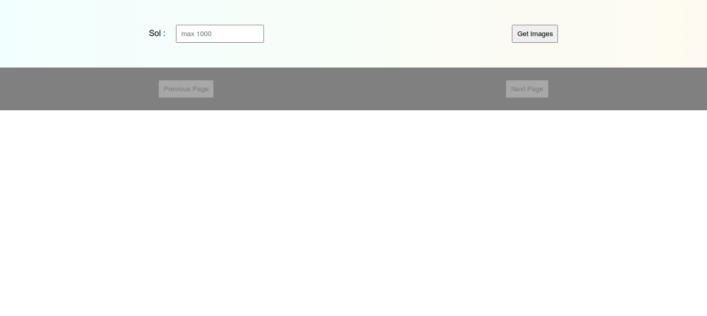
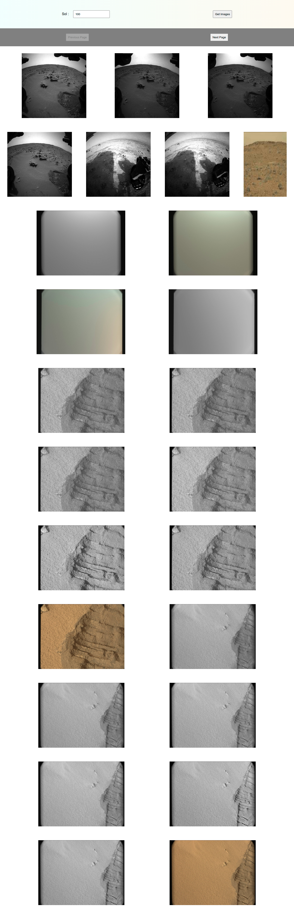
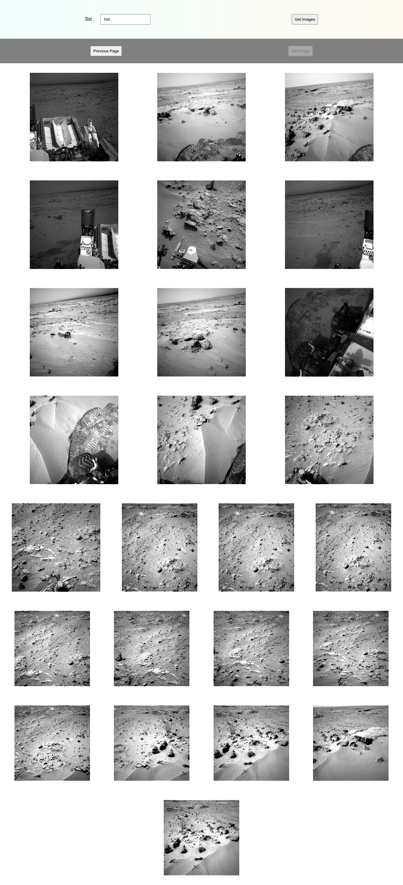

# traverse-pages
- A website to fetch Mars rover photos using NASA's API 
`(https://api.nasa.gov/mars-photos/api/v1/rovers/curiosity/photos?sol=1000&amp;camera=fhaz&amp;api_key=DEMO_KEY)`

##### The web page looks like this -

##### After getting the images, the web page would look like this -

##### On reaching the end of the page, it would look like this -

